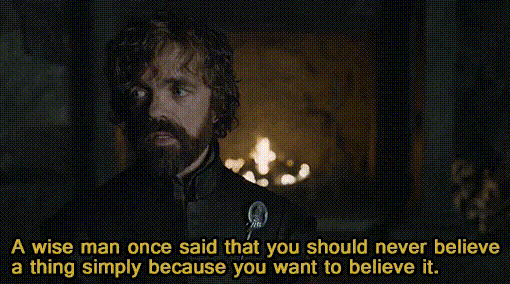

    

# DinkleBot

Dinklebot is a companion app for [Destiny 2](https://www.bungie.net/7/en/Destiny/BeyondLight). 

I plan to use this project to learn about flutter patterns, test out new frameworks/libraries and maintain a knowledge base.

- [Learning Topics](#learning-topics)
- [Features](#features)
- [Why the Name](#why-the-name)

## Learning Topics

    

#### Architecture
  - [ ] [ResoCoder - Flutter Developer Bootcamp](https://resocoder.com/fdb/)
#### Persited Storage
  - [ ] [sembast](https://github.com/tekartik/sembast.dart)
  - [ ] [isar](https://github.com/isar/isar)
#### API 
  - [ ] [dio](https://github.com/flutterchina/dio)
#### Tests
  - [ ] Unit Tests
  - [ ] Integration Tests
  - [ ] Snapshot Tests
#### Misc
##### Linting
  - [ ] [Lint](https://github.com/passsy/dart-lint)
##### CI/CD
  - [ ] GitHub Actions
  - [ ] FastLane deployment to app store

## Features

### Version 1.0

- [ ] Have a good architecture that I can easily extend for other features/changes
- [ ] Integrate with the Bungie.net API
- [ ] Show the current mods available at Banshee 44 and Ada 1 for today
- [ ] Show if the current player has these mods
- [ ] Add a equipment-collect-list so I can keep track of weapon rolls I am trying to get
- [ ] Add a todo list for non weapon rolls, e.g., "Play tirals to get the Messanger"
- [ ] Add a todo list for non weapon rolls, e.g., "Play tirals to get the Messanger"

## Why the Name
Where did the name "Dinklebot" come from initially?
>Ghosts were sometimes called "Dinklebots" by players, as a nod to Peter Dinklage,[23](https://www.destinypedia.com/Ghost#cite_note-23) who provided their voice in the game. As of The Taken King, Nolan North replaced Dinklage as Ghost's voice actor and redubbed lines from the original Destiny game.[24](https://www.destinypedia.com/Ghost#cite_note-24) Players have started to call this new Ghost "Nolandroid", though Nolan North himself prefers "Nolanbot".[25](https://www.destinypedia.com/Ghost#cite_note-25)

From https://www.destinypedia.com/Ghost
